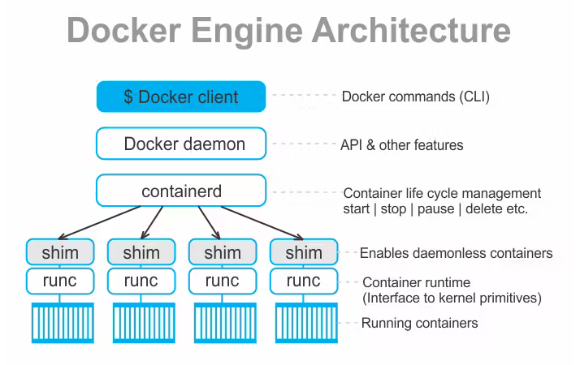

The Docker engine is the core component of the Docker architecture that makes containerization possible. In this blog, we'll explore the architecture of the Docker engine and how it works.

**The Docker engine is made up of several components**, including the Docker daemon, containerd, and runc.

**1-Docker Daemon** : The Docker daemon is the primary component of the Docker engine. It runs on the host machine and is responsible for managing the Docker containers, images, and networks. The Docker daemon listens for requests from the Docker client and performs the requested actions. It also interacts with containerd and runc to create and manage containers.

**2-Containerd** : It is a container runtime that provides a high-level API for managing containers. It is responsible for low-level container operations, such as container start, stop, and pause. Containerd communicates with the Docker daemon to create and manage containers.
    
**3-Runc:** Runc is a lightweight **command-line tool** for running containers. It is responsible for setting up the container's environment, creating and managing namespaces, and starting the container process. Runc is used by containerd to start and manage containers.

**4-Containerd-shim** : The Containerd-shim is a lightweight process that acts as an intermediary between the Docker daemon and containerd. It is responsible for managing the container's lifecycle and communicating with the Docker daemon.
