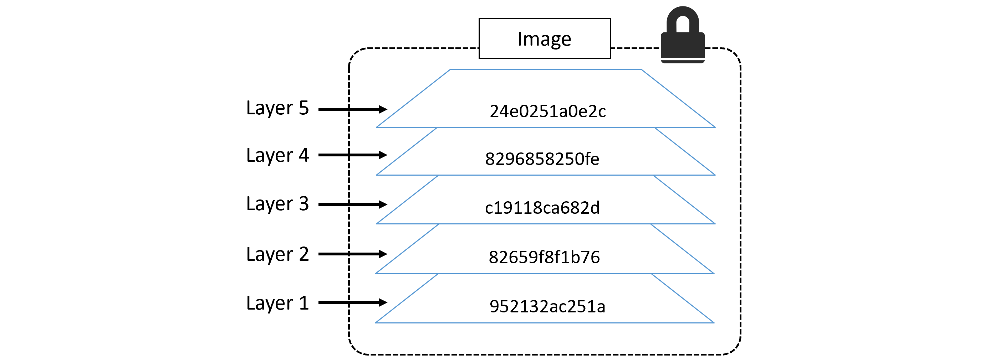

A **Docker image** is a lightweight, standalone, and executable software package that includes everything needed to run a piece of software, including:

- **Code**: The application or service you want to deploy.
- **Runtime**: Dependencies and libraries required to run the code.
- **Environment Variables**: Configuration data and system-specific variables.
- **System Tools**: Essential binaries and utilities.
- **System Libraries**: Shared libraries required by the binaries.

Docker images serve as the **blueprint** for creating Docker containers.

### **How Docker Images Work**

1. **Immutable**:
    
    - Docker images are read-only. Once created, you cannot modify them directly.
    - Any changes applied while running a container are not saved back to the original image but can be saved as a new image.
2. **Layered Structure**:
    
    - Docker images are built using a layered filesystem.
    - Each layer represents a set of changes (like adding files, installing software, or modifying configuration).
    - These layers are **stacked** on top of each other, starting from a base image (like `ubuntu`, `alpine`, or `debian`).
3. **Efficient Reuse**:
    
    - Since Docker uses layers, common layers across multiple images (e.g., the same base OS) are reused to save storage space and speed up builds.

---

### **Structure of a Docker Image**

Docker images consist of multiple components:

1. **Base Layer**:
    
    - This is usually a minimal operating system image (like `ubuntu`, `alpine`, or `centos`).
    - It provides the foundation for the rest of the image.
2. **Application Layer(s)**:
    
    - Additional layers build on the base by installing software, copying files, or defining configurations.
3. **Metadata**:
    
    - Information about the image (e.g., its size, creation date, and author).
    - Instructions for the container runtime, such as environment variables or default commands.

---

### **Docker Image Lifecycle**

1. **Pull**:
    
    - Download an existing image from Docker Hub or another registry.
    - Example: `docker pull nginx`
2. **Build**:
    
    - Create a custom image using a Dockerfile.
    - Example: `docker build -t my-app .`
3. **Tag**:
    
    - Assign a name and version to your image.
    - Example: `docker tag my-app:latest my-repo/my-app:v1.0`
4. **Push**:
    
    - Upload your image to a registry (e.g., Docker Hub or a private registry).
    - Example: `docker push my-repo/my-app:v1.0`
5. **Run**:
    
    - Create a container from the image.
    - Example: `docker run -d my-app`


---

### **Common Docker Image Commands**

- **List Images**:  Displays all images on your system.
```bash
  docker images
```
- **Remove an Image**: Deletes an image by its ID or name.
```bash
docker rmi <image-id>
```
- **Inspect an Image**: Shows detailed information about the image.
```bash
docker inspect <image-name>
```
- **Pull an Image**: Downloads the specified image from a registry.
```bash
docker pull <image-name>
```

---

### **1. Build-Time Constructs**

These are configurations, instructions, and actions that are executed while creating the **Docker image** (during the `docker build` process). Build-time constructs define the image's contents and how it's structured.

#### Key Concepts and Examples:

- **Dockerfile Instructions**:
    
    - **`FROM`**: Specifies the base image for the build (e.g., `alpine`, `ubuntu`).
	    ```dockerfile
	    FROM ubuntu:20.04
		```

    - **`RUN`**: Executes commands to install software or configure the image.
		```dockerfile
		RUN apt-get update && apt-get install -y nginx
		```

	- **`COPY`/`ADD`**: Copies files from the host to the image.
		```dockerfile
		COPY app.py /usr/src/app/
		```    

	- **`ENV`**: Sets environment variables for the image during build.
		```dockerfile
		ENV APP_ENV production
		```

- **Context**:
	- The build process uses a **build context**, which includes the files and directories available to the `docker build` command.
- **Build Arguments (`ARG`)**:
	- Variables used only during the build process. These are not available at runtime.
		```dockerfile
		ARG VERSION=1.0
		RUN echo "Building version $VERSION"
		```

- **Layer Caching**:
	-  Docker reuses previously built layers if the commands and source files haven't changed, speeding up the build process.
#### Use Case:
You use build-time constructs to:
1. Define the dependencies, tools, and environment for your application.
2. Package your application into an image for deployment.


### **2. Runtime Constructs**

These are configurations and parameters applied to the **container** when it is created or run from a Docker image (during the `docker run` process). Runtime constructs influence the container's behavior and environment.

----

### **Docker Registry**


A **Docker registry** is a service that stores and distributes Docker images. The most common registry is **Docker Hub**, but other registries include **Amazon ECR**, **Google Artifact Registry**, and **self-hosted solutions** like **Harbor**.
#### Key Features:

- **Public vs. Private Registries**:
    
    - Public: Open to anyone (e.g., Docker Hub).
    - Private: Controlled access (e.g., private repositories on Docker Hub or self-hosted registries).
- **Custom Registries**:
    
    - You can host your own registry using Docker's `registry` image.
	```bash
	docker run -d -p 5000:5000 --name registry registry:2
	```

- **Multiple Registries**:
	- Docker CLI can interact with multiple registries by specifying the full image path (including the registry).

# Repositories
Docker Registry consist of multiple Repositories.
A Docker Hub repository is a collection of container images, enabling you to store, manage, and share Docker images publicly or privately. Each repository serves as a dedicated space where you can store images associated with a particular application, microservice, or project. Content in repositories is organized by tags, which represent different versions of the same application, allowing users to pull the right version when needed.

### **Image Naming in Docker**

A Docker image name typically follows this pattern:
```plaintext
[REGISTRY]/[REPOSITORY]:[TAG]
```
#### Components:

- **`REGISTRY` (Optional)**:
    
    - Refers to the Docker registry where the image is hosted. The default is Docker Hub.
    - Example: `registry.example.com/my-image:1.0`
- **`REPOSITORY`**:
    
    - The name of the repository in the registry. A repository can store multiple versions (tags) of an image.
    - Example: `my-image` or `user/my-image`.
- **`TAG` (Optional)**:
    
    - Indicates the specific version or variant of the image. If omitted, Docker uses the default tag `latest`.
    - Example: `my-image:1.0`, `my-image:stable`, or `my-image:dev`.

#### Examples of Image Names:

- `nginx`: Fetches the `latest` tag of the official `nginx` image from Docker Hub.
- `ubuntu:20.04`: Fetches the `20.04` tag of the `ubuntu` image from Docker Hub.
- `myregistry.com/my-app:v2`: Fetches the `v2` tag of `my-app` from a custom registry at `myregistry.com`.


### **Official vs. Community-Contributed Images**

#### **Official Images**:

- Curated and maintained by Docker or verified organizations.
- Hosted on Docker Hub, prefixed with no namespace.
    - Example: `nginx`, `ubuntu`, `mysql`.
- Features:
    - Regular updates and security patches.
    - High-quality standards.
    - Comprehensive documentation.
- **Naming Convention**:
    - Simply the image name (e.g., `nginx`, `python`).

#### **Community-Contributed Images**:

- Created and maintained by the community.
- Often hosted on Docker Hub under a namespace (username/organization).
    - Example: `myusername/nginx-custom`, `bitnami/mysql`.
- Features:
    - May include customizations or additional features not found in the official version.
    - Quality and updates depend on the maintainer.

#### Example Comparison:

| **Aspect**         | **Official Image**   | **Community-Contributed Image**          |
| ------------------ | -------------------- | ---------------------------------------- |
| **Name**           | `mysql`              | `bitnami/mysql`                          |
| **Maintained By**  | MySQL/Docker Team    | Bitnami or individual contributors       |
| **Updates**        | Regular and official | May vary based on the maintainer         |
| **Customizations** | Basic configurations | May include additional tools or features |

---
 
### **how docker detect the OS and architecture ?**
#### **1. Metadata in Docker Images**

Every Docker image contains metadata that specifies:

- **Operating System**: Indicates the OS the image is designed for (e.g., Linux, Windows).
- **Architecture**: Specifies the CPU architecture the image supports (e.g., `amd64`, `arm64`, `arm`, `ppc64le`, etc.).

This information is part of the **image manifest**, which is fetched from the registry when you pull or use an image.

###### Example of Metadata in an Image Manifest:
```json
{
  "architecture": "amd64",
  "os": "linux",
  "os.version": "10.0.14393.0",
  "os.features": ["win32k"],
  "variant": null
}
```
- **`architecture`**: CPU architecture (e.g., `amd64` for x86-64).
- **`os`**: Operating system (e.g., `linux` or `windows`).

#### **2. How Docker Detects the Host OS and Architecture**

**Step 1: Docker Engine Checks Host Environment**

When Docker starts, it identifies the system's:

- **Kernel version**: Determines if the host runs Linux or Windows.
- **CPU architecture**: Detects whether the host supports `x86`, `ARM`, `PowerPC`, etc.

Docker uses these system properties to enforce compatibility between images and the host.

**Step 2: Matching Image Metadata**

When you pull or run an image:

1. Docker fetches the image manifest from the registry.
2. It compares the **`os`** and **`architecture`** fields in the manifest with the host's environment.
3. If the metadata matches the host environment, Docker pulls and runs the image.
4. If the metadata doesn’t match, Docker will:
    - Pull an image for a matching architecture if it's part of a **multi-architecture image**.
    - Throw an error if no compatible image is found.

#### **3. Multi-Architecture Images and Platform Support**

Docker supports **multi-architecture images**, allowing a single image name to work on multiple platforms. For example:

- A `nginx` image can have variants for `amd64`, `arm64`, etc.

#### Key Features:

- **Platform-Specific Tags**: Each architecture and OS version has its own tag in the repository (e.g., `nginx:linux/amd64` or `nginx:linux/arm64`).
    
- **Image Manifest Lists**: Docker uses a **manifest list** (or "fat manifest") to represent multiple architectures under a single image tag.
```bash
docker pull nginx
```
- On an `amd64` system, Docker pulls `nginx:linux/amd64`.
- On an `arm64` system, Docker pulls `nginx:linux/arm64`.

#### **4. Manually Specifying Platform**

You can specify the platform explicitly when pulling or running images using the `--platform` flag:
```bash
docker pull --platform linux/arm64 nginx
```
Docker downloads the `arm64` version of the `nginx` image, even on a different architecture.

### **Manifest List**

A **manifest list**, also called a "fat manifest," is a higher-level JSON object that references multiple image manifests for different OS and architecture combinations. Each entry in the manifest list specifies:
- **Platform**: The `os` and `architecture` the entry supports (e.g., `linux/amd64`, `linux/arm64`).
- **Digest**: The unique identifier (SHA256 hash) of the specific image manifest for that platform.


Example of a Manifest List (Simplified):
```json
{
  "manifests": [
    {
      "platform": {
        "architecture": "amd64",
        "os": "linux"
      },
      "digest": "sha256:12345"
    },
    {
      "platform": {
        "architecture": "arm64",
        "os": "linux"
      },
      "digest": "sha256:67890"
    }
  ]
}

```

#### **How Docker Selects Layers to Fetch**

When you pull an image by name (e.g., `nginx`):

1. **Docker Determines the Host Platform**:
    
    - Based on the `docker info` command output (`os` and `architecture`).
2. **Docker Queries the Manifest List**:
    
    - The client fetches the manifest list from the Docker registry.
3. **Docker Selects the Matching Manifest**:
    
    - It looks for the manifest entry matching the host platform (e.g., `linux/amd64`).
    - If a matching platform is not found, the pull fails unless a specific platform is specified via the `--platform` flag.
4. **Docker Downloads Only Relevant Layers**:
    
    - The digest in the manifest points to the layers that constitute the image for the selected platform.
    - Docker fetches and caches only these layers.

#### **Layers Are Platform-Specific**

Each platform-specific image in the manifest list has its own set of layers. These layers contain the filesystem and binaries for the target OS/architecture.

For example:

- An `amd64` image might contain x86-64 binaries.
- An `arm64` image would include ARM binaries.

Docker ensures that:

- Only the layers relevant to the host's platform are fetched and unpacked.
- Layers from other platforms in the manifest list are ignored.

---

### Images and layers
Docker images are made up of multiple read-only **layers**, where each layer represents a set of changes (e.g., adding files, modifying configurations)

**Example Structure**:
```plaintext
Layer 1: Base Layer (Alpine Linux)
Layer 2: Install Python runtime
Layer 3: Add application dependencies (e.g., Flask)
Layer 4: Copy application files
Layer 5: Set environment variables
Layer 6: Define CMD to run the app (e.g., `python app.py`)
```

#### **SHA for Each Layer**
Each layer is uniquely identified by a **SHA256 hash**. This hash is calculated based on the layer's **content**.

- **Uses of the SHA**:
    
    1. **Cache Management**: Docker uses the SHA to determine whether a layer already exists locally. If the layer exists, Docker reuses it instead of downloading/building it again.
    2. **Image Integrity**: The SHA ensures that the layer's data has not been tampered with during transfer or storage.
    3. **Layer Deduplication**: Multiple images can share layers with the same SHA, saving storage space.

#### **How to Show All Layers for a Specific Image**

**Command 1: `docker history`**

Displays the layers of an image, including the commands used to create them.
```bash
docker history <image_name>
```


**Command 2: `docker inspect`**

Provides detailed metadata for an image, including layer IDs (SHA hashes).
```bash
docker inspect <image_name>
```


