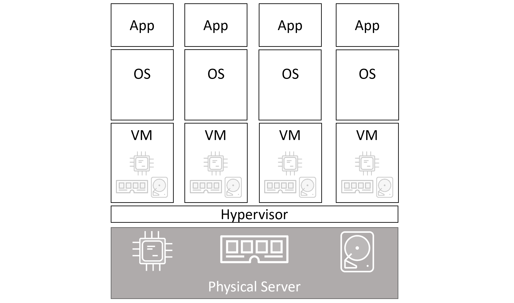

### What Is a Container?

A **container**  is a running instance of a Docker image.
It is a lightweight, standalone, and executable package that includes everything needed to run a piece of software: the code, runtime, libraries, dependencies, and system tools. Containers are isolated from each other and the host system, ensuring consistency across different environments.

### Containers vs VMs


**VMs Architecture**




**Containers Architecture**


### Starting a simple container

```bash
$ docker container run -it ubuntu:latest
```

1. Docker client POSTs the request to Docker API on local socket `/var/run/docker.sock`
2. Docker daemon checks the local repo for the `ubuntu:latest` image, if it's not their it will check Docker Hub.
3. After obtaining the image it instructs `containerd` and 'runc' to create and run the container.

- `-i` run container in interactive mode keeping STDIN stream open
- `-t` Allocate a pseudo-TTY
- `/bin/bash` this makes Bash shell **one and only process running inside of the container**. Run `ps -elf` to validate.
- `root@50949b614477:/#` container pseudo terminal


### Container processes

- `/bin/bash` is the only process running in the container, hence if you run `exit` it will exit and terminate the container.
- **killing the main process in the container will kill the container**

### Commands to Get Started

Here are some common Docker commands to work with containers:
1. **Run a container**:
```bash
docker run -it ubuntu
```
2. **List running containers**:
```bash
docker ps
```
3. **Stop a container**:
```bash
docker stop <container_id>
```
4. **Remove a container**:
```bash
docker rm <container_id>
```
5. **List all containers (including stopped)**:
```bash
docker ps -a
```


When running Docker containers, you can provide various **arguments** and options to control the behavior of the container. These arguments are passed to the `docker run` command, allowing you to customize aspects like networking, resource limits, volume mounting, and environment variables.

Here’s a breakdown of the most commonly used arguments:

**1. Interactive and Detached Modes**
- **Interactive Mode (`-it`)**:
	- Combines `-i` (keep STDIN open) and `-t` (allocate a pseudo-TTY).
	- Useful for interacting with a container directly, such as running a shell.
	
- **Detached Mode (`-d`)**:Runs the container in the background.
```bash
docker run -d nginx
``` 

**2. Naming Containers**
- Use the `--name` argument to assign a custom name to the container.
```bash
docker run --name my-web-server nginx
```


 **3. Environment Variables**
 - Pass environment variables to a container using the `-e` or `--env` flag.
 - Useful for configuring applications inside the container.
```bash
 docker run -e MYSQL_ROOT_PASSWORD=my-secret-pw mysql
```


**4. Port Mapping**
- Use the `-p` flag to map a container's port to a port on the host machine.
- Syntax: `-p <host_port>:<container_port>`.
```bash
docker run -p 80:80 nginx
```

**5. Volume Mounting** 
- Use the `-v` flag to mount directories or files from the host to the container.
- Syntax: `-v <host_path>:<container_path>`.
```bash
docker run -v /host/data:/container/data nginx
```

This mounts the host directory `/host/data` into `/container/data` inside the container.


 **6. Restart Policies**
Restart policies are applied per-container, and can be configured imperatively on the command line as part of `docker container run` commands, or declaratively in YAML files for use with higher-level tools

**`always`**  
container will always restart if the main process is killed from inside the container but won't restart if you manually stopped it. Will restart if the Docker daemon restarts.  

**`unless-stopped`**  
container will always restart if the main process is killed from inside the container but won't restart if you manually stopped it. However will NOT restart if the Docker daemon restarts.  

**`on-failue`**  
container will always restart if the main process exits with non-zero code (i.e. with error) but won't restart if you manually stopped it. However will restart if the Docker daemon restarts.

```bash
docker run --restart=always nginx
```

**7. Limiting Resources**
- Constrain CPU and memory usage for a container.
- **CPU**: Use `--cpus` to limit the number of CPU cores.
- **Memory**: Use `--memory` to limit memory usage.
```bash
docker run --cpus="1.5" nginx
docker run --memory="512m" nginx
```
 
 **8. Custom Network Configuration**
 - Use the `--network` flag to specify a network for the container.
 ```bash
docker network create my-network
docker run --network=my-network nginx
```

**9. Overriding the Default Command**
- Override the command specified in the Docker image using `docker run <image> <command>`.
```bash
docker run ubuntu echo "Hello, Docker!"
```


**10. Attach Mode**
- Use `--attach` to connect to a running container's output
```bash
docker run --name test-container -d ubuntu sleep 100
docker attach test-container
```


**11. Setting Working Directory**
- Use the `-w` flag to set the working directory inside the container.
```bash
docker run -w /app -it ubuntu
```

**12. Running as a Specific User**
- Use the `-u` flag to specify a user inside the container.
```bash
docker run -u 1001:1001 ubuntu
```

### Example: Combining Arguments

Let’s create a fully customized container:
```bash
docker run -dit \
  --name my-container \
  -e APP_ENV=production \
  -p 5000:5000 \
  -v /mydata:/app/data \
  --memory="1g" \
  --cpus="2.0" \
  ubuntu bash
```

