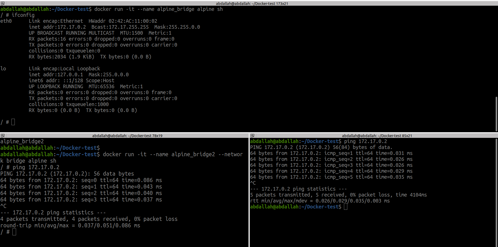
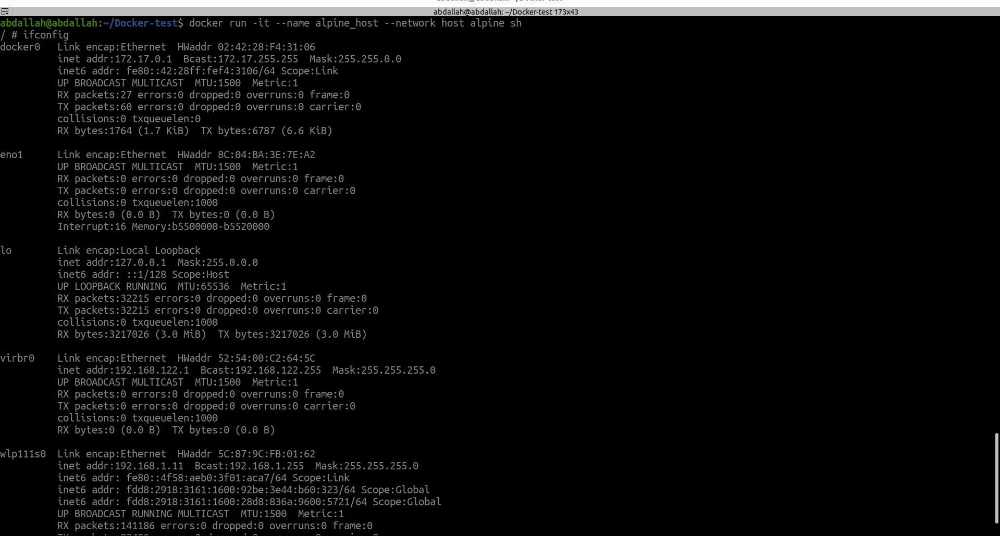
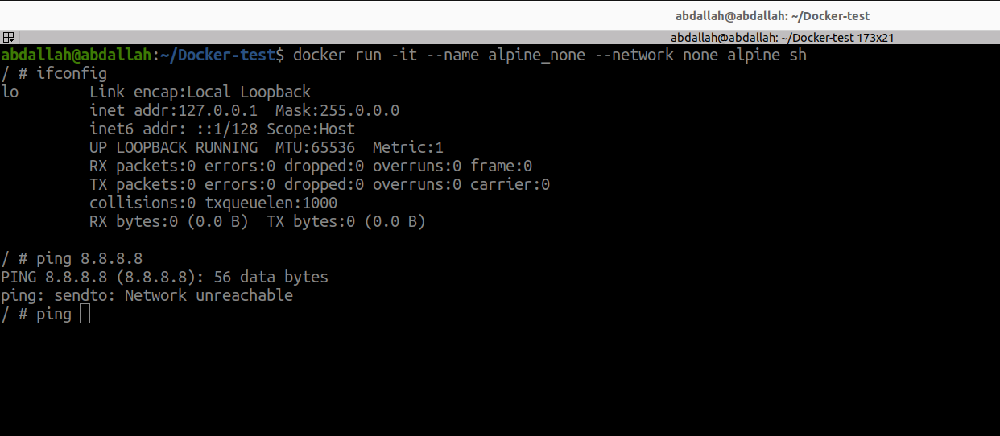
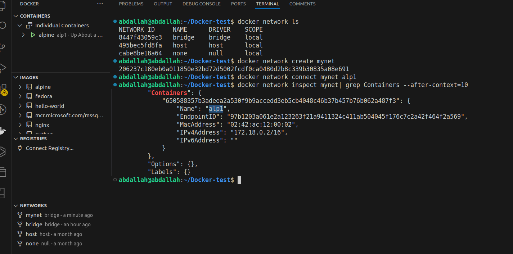

Docker provides different networking drivers (`bridge`, `host`, and `none`) to configure how containers communicate with each other and the host system.


### **1. Bridge Network**

The **default network driver** for Docker containers is `bridge`. It creates an isolated network for containers, allowing communication between containers in the same network while separating them from the host and other networks.


1. **Run an Alpine Container in the Default Bridge Network**
```bash
docker run -it --name alpine_bridge alpine sh
```
2. **Verify Networking Inside the Container** Inside the container, check the IP configuration:
```bash
ifconfig
```
You should see an IP address in the `172.x.x.x` range, assigned by Docker's default `bridge` network.
3. **Ping Another Container** Create another Alpine container in the same network:
```bash
docker run -it --name alpine_bridge2 --network bridge alpine sh
```
From one container, you can ping the other using its container name:
```bash
ping alpine_bridge2
```
 



### **2. Host Network**

The **host network driver** removes the isolation between the container and the host network. The container shares the host's network stack, meaning it uses the same IP address as the host.


1. **Run an Alpine Container in the Host Network**
```bash
docker run -it --name alpine_host --network host alpine sh
```
2. **Verify Networking Inside the Container** Inside the container, check the IP configuration:
```bash
ifconfig
```
The container will show the host's network interfaces (e.g., `eth0` or `wlan0`).



### **3. None Network**

The **none network driver** disables networking for the container entirely. The container has no access to the internet or other containers.

1. **Run an Alpine Container in the None Network**
```bash
docker run -it --name alpine_none --network none alpine sh
```
2. **Verify Networking Inside the Container** Inside the container, check the IP configuration:
```bash
ifconfig
```
You’ll see only the `lo` (loopback) interface, with no other network interfaces.
3. **Try to Ping the Host** Attempting to ping the host or any other service will fail:
```bash
ping 8.8.8.8
```



### **Comparison Table**

|**Network Mode**|**Description**|**Use Case**|
|---|---|---|
|**Bridge**|Default isolated network for containers|Communication between containers in an isolated environment.|
|**Host**|Shares host network stack|For high-performance or low-latency applications, where network isolation is not needed.|
|**None**|No networking|For security purposes or running tasks that don’t require networking.|
 
### Docker network drivers
### **1. Bridge (Default Network Driver)**

The **bridge** driver is the default for standalone containers when no network is specified. It creates a private, isolated network on the Docker host, allowing containers to communicate with each other while being isolated from external networks.

```bash
docker network create my_bridge_network
docker run --network my_bridge_network -d --name container1 alpine
```

or we can connect network with running container
```bash
docker network connect mynet alp1
```



**Docker Network Options:**
- **`--subnet`**: Defines a custom IP range for the network.  
```bash
docker network create --subnet=192.168.1.0/24 my_network
```
- **`--gateway`**: Sets a specific gateway for the network.  .
```bash
docker network create --subnet=192.168.1.0/24 --gateway=192.168.1.1 my_network
``` 
- **`--ip-range`**: Restricts IPs Docker can assign from the subnet.  
```bash
docker network create --subnet=192.168.1.0/24 --ip-range=192.168.1.128/25 my_network
```
- **`--driver`**: Specifies the network type (e.g., bridge, overlay).  
```bash
docker network create --driver overlay my_network
```
- **`--internal`**: Creates an isolated network with no external access(just between containers).
```bash
docker network create --internal my_network
```
- **`--ipv6`**: Enables IPv6 addressing for the network.  
```bash
docker network create --ipv6 --subnet=2001:db8:1::/64 ipv6_network
```

**How to disconnect network from container?** 
```bash
docker network disconnect mynet alp1
```
### **2. Host**

The **host** driver removes the network isolation between the container and the Docker host. The container directly uses the host’s network stack.

### **3. None**

The **none** driver disables all networking for the container. The container has no external network access except for the loopback interface.

### **4. Overlay**

The **overlay** driver is designed for multi-host networking in Docker Swarm or Kubernetes. It allows containers running on different hosts to communicate as if they were on the same network.

### **5. Macvlan**

The **macvlan** driver assigns a MAC address to each container and allows it to appear as a physical device on the network. Containers can communicate with the outside world directly using their

### **6. IPvlan**

The **ipvlan** driver is similar to Macvlan but operates at Layer 3 (IP level) instead of Layer 2. It’s more suitable for environments with strict network policy requirements.

### **7. Third-Party (Plugin)**

Docker supports third-party network drivers through plugins. These can be used to integrate Docker containers with external networking solutions like SDN (Software-Defined Networking) platforms.

### **Comparison of Drivers**

| **Driver**  | **Scope**   | **Isolation** | **Use Case**                      |
| ----------- | ----------- | ------------- | --------------------------------- |
| **Bridge**  | Single-host | Yes           | Isolated networks on one host.    |
| **Host**    | Single-host | No            | High-performance network tasks.   |
| **None**    | Single-host | Yes           | Network-less containers.          |
| **Overlay** | Multi-host  | Yes           | Distributed container networks.   |
| **Macvlan** | Single-host | No            | Containers as standalone devices. |
| **IPvlan**  | Single-host | No            | IP-based advanced configurations. |
