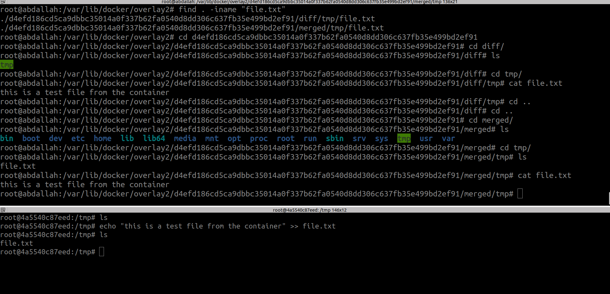
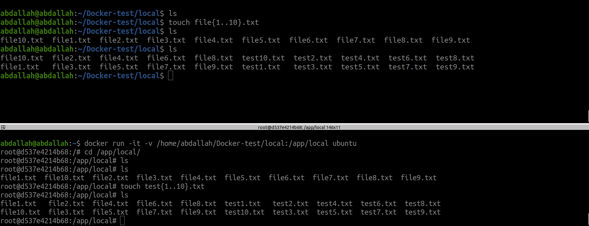
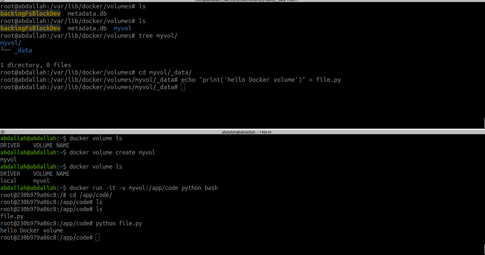

Docker uses the **OverlayFS** storage driver to manage images and containers. When pulling an image and running a container, Docker creates specific directories in `/var/lib/docker/overlay2` to handle the image layers and the container's writable layer.

### 1. **When Pulling an Image**

- **What happens**:
    
    - Docker downloads the image layers and stores them in `/var/lib/docker/overlay2`.
    - Each layer corresponds to a directory named by its layer ID.
    - These directories contain the filesystem data for that layer and metadata files.
- **Key Directories**:
    
    - `/var/lib/docker/overlay2/<layer-id>/`: Stores image layer data.
    - Layers are read-only and can be shared between multiple images or containers.

### 2. **When Starting a Container**

- **What happens**:
    
    - Docker creates a new directory in `/var/lib/docker/overlay2`.
    - A **writable "diff" directory** is created to store changes made by the container.
    - This writable layer is merged with the read-only image layers using **OverlayFS**.
- **Key Directories**:
    
    - `/var/lib/docker/overlay2/<container-id>/diff/`: Contains all changes made by the container, such as new or modified files.
    - `/var/lib/docker/overlay2/<container-id>/merged/`: Represents the merged view of the read-only layers and the writable diff directory.

### Example Workflow

1. **Pulling an Image**:(Image layers are stored in `/var/lib/docker/overlay2`.)
```bash
docker pull alpine
```
2. **Starting a Container**:(`diff/`: To store container-specific changes (writable).`merged/`: The combined view of the image layers and the writable layer.)
```bash
docker run -it alpine
```
3. **Making Changes**:(If you add a file inside the container, The `diff/` directory is updated with this new file.)
```bash
touch /newfile
```




once we delete this container, all changes are dropped(Non-Persistent Storage).

### Persistent vs. Non-Persistent Storage in Docker

**1.Non-Persistent Storage**
**Definition**: Temporary data that is lost when the container stops or is removed.Temporary files or caches that are only needed during container runtime.
**Options**:

- **Container Filesystem**: Stores data inside the container itself (ephemeral by default).
- **tmpfs Mounts**: Stores data in the host system’s memory, ensuring it's gone when the container stops.


**2.Persistent Storage**

- **Definition**: Data that outlives the lifecycle of a container. It remains available even after the container is stopped or deleted.
**Options**:
- **Bind Mounts**: Directly map a host directory to ensure persistence.
```bash
docker run -it -v /path/on/host:/path/on/container ubuntu
```

```bash
docker run -it -v /home/abdallah/Docker-test/local:/app/local ubuntu
```




- **Volumes**: Managed by Docker, ideal for long-term storage.
```bash
docker volume create myvol
docker run -it -v myvol:/app/code python bash
```


